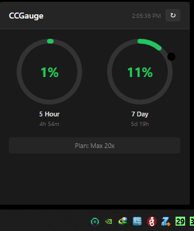

# CCGauge


Cross-platform system tray application to monitor your Claude Code usage.



## Features

- 🔄 **Auto Refresh**: Updates usage data every 2 minutes
- 📊 **Circular Graphs**: Visualizes 5-hour and 7-day usage
- 🔔 **Notifications**: Desktop notification when usage exceeds 90%
- 🎨 **Dynamic Icon**: Tray icon color changes based on usage
  
  | Status | Icon | Usage |
  |--------|------|-------|
  | Normal |  | < 70% |
  | Warning |  | 70-90% |
  | Critical |  | ≥ 90% |
  | No Data |  | - |

- 💡 **Tooltip**: Shows current usage on hover
- 🖥️ **Cross-Platform**: Windows, macOS, and Linux support

## Requirements

- [Node.js](https://nodejs.org/) 18+
- [Claude Code](https://claude.ai/code) installed and logged in

## Installation

```bash
# Install dependencies
npm install

# Run in development mode
npm run electron:dev
```

## Building

```bash
# Build for current platform
npm run electron:build

# Build for specific platform
npm run electron:build:win    # Windows (.exe)
npm run electron:build:mac    # macOS (.dmg)
npm run electron:build:linux  # Linux (.AppImage, .deb)

# Build for all platforms
npm run electron:build:all
```

### Build Output

| Platform | Output |
|----------|--------|
| Windows | `CCGauge Setup x.x.x.exe`, `CCGauge x.x.x.exe` (portable) |
| macOS | `CCGauge-x.x.x.dmg` |
| Linux | `CCGauge-x.x.x.AppImage`, `ccgauge_x.x.x_amd64.deb` |

## How It Works

CCGauge reads Claude Code credentials and queries the Anthropic API:

1. Reads OAuth token from `~/.claude/.credentials.json`
2. Sends request to `https://api.anthropic.com/api/oauth/usage`
3. Displays usage data in a visual format

> ⚠️ If you haven't logged in to Claude Code, run `claude` in your terminal first.

## Usage

- **Left click**: Toggle window
- **Right click**: Context menu
  - Show
  - Refresh
  - Notifications (toggle)
  - Start at Login / Start with Windows
  - Quit

## Project Structure

```bash
ccgauge/
├── .github/
│   └── workflows/
│       └── build.yml       # GitHub Actions CI/CD
├── electron/
│   ├── main.ts             # Electron main process
│   ├── preload.ts          # IPC bridge
│   ├── credentials.ts      # Claude Code credential reader
│   └── claudeApi.ts        # Anthropic OAuth API client
├── src/
│   ├── App.tsx             # React UI with circular gauges
│   ├── main.tsx            # React entry point
│   ├── index.css           # Styles
│   └── types/
│       └── index.ts        # TypeScript interfaces
├── assets/
│   ├── icon.svg            # Source icon (SVG)
│   ├── icon.png            # App icon (512x512)
│   ├── icon.ico            # Windows icon
│   ├── icon_*.png          # Icon size variants
│   ├── tray_green.png      # Tray icon (normal)
│   ├── tray_orange.png     # Tray icon (warning)
│   ├── tray_red.png        # Tray icon (critical)
│   └── tray_gray.png       # Tray icon (no data)
├── package.json
├── tsconfig.json
├── tsconfig.electron.json
├── vite.config.ts
└── README.md
```

## Platform Notes

### Windows

- Appears in system tray
- Uses `icon.ico` for app icon

### macOS

- Appears in menu bar (dock icon hidden)
- Builds require macOS or GitHub Actions

### Linux

- Works with most desktop environments (GNOME, KDE, etc.)
- AppImage is portable, no installation needed
- `.deb` package for Debian/Ubuntu

## License

MIT
